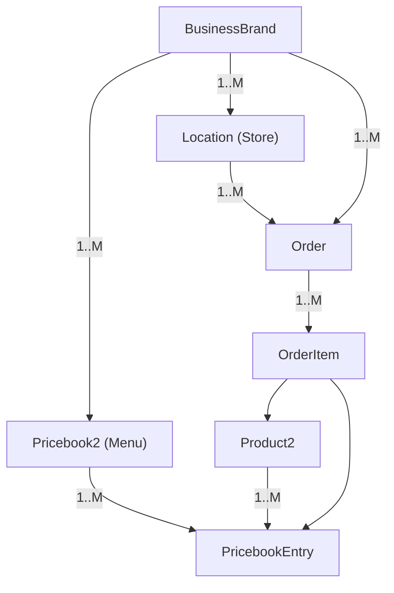

# Order-to-Pickup Architecture

LWR Experience Cloud ordering site for a donut brand with 4 stores. Guests can browse and place pickup orders; store staff manage fulfillment.

## Personas & Licensing

- **Customer (guest)**: public/anonymous; no license; can browse menu and place orders.
- **Counter Staff (auth)**: Customer Community+ (4 named users for initial rollout); store-scoped access to orders.
- **Admin/Dev**: 1 internal Salesforce license for configuration and deployments.
- **Future multi-brand scaling**: add additional Community+ users per brand as needed; each brand can have its own LWR site with brand-scoped guest profile and store-scoped sharing for that brand’s staff.

## Data Model (retrieved metadata)

- **BusinessBrand**
  - Brand code `O2P_Brand_Code__c` (unique, external ID), domain slug `O2P_Domain_Slug__c` (unique), active flag `O2P_Active__c`, theme fields (`O2P_Primary_Color__c`, logo/support fields).
- **Pricebook2** (menu)
  - Lookup to BusinessBrand `O2P_Business_Brand__c` (required).
  - Effective dates `O2P_Effective_Start__c`, `O2P_Effective_End__c`.
- **Product2**
  - Menu sort `O2P_Display_Order__c`; priced via `PricebookEntry`.
- **PricebookEntry**
  - Standard pricing rows tied to Product2 and Pricebook2.
- **Location** (standard)
  - Used as Store; Order lookup points here.
- **Order** (standard)
  - Store lookup `Store__c` (to Location); derived brand formula `Brand__c`.
  - Customer details `Customer_Name__c` (required), `Customer_Email__c`, `Customer_Phone__c`, `Special_Instructions__c`.
  - Pickup scheduling `Pickup_Date_Time__c` (required); lifecycle stamps `Placed_At__c`, `In_Progress_At__c`, `Ready_At__c`, `Picked_Up_At__c`.
  - Payments: provider picklist `Payment_Provider__c`, payment state picklist `Payment_Status__c`, external ID `Payment_Intent_ID__c` (unique).
- **OrderItem**
  - Standard relationship to Order and PricebookEntry/Product2; no custom fields.

## Key Relationships

## Access & Sharing Design

- **Guest (customer)**
  - Object perms: create/read Order, OrderItem; read Product2, Pricebook2, PricebookEntry, BusinessBrand, Location.
  - Field perms: allow customer fields and pickup datetime; restrict payment provider/status to read-only or hidden for guests; keep Payment Intent ID system-set.
  - Sharing: guest uses site guest user; orders created by guest owned by integration/user; rely on sharing rule that grants guest read on their newly created records (manual share or sharing set via contactless approach using Apex after insert).
  - Data visibility: no access to other orders beyond confirmation page; store lists hidden.

- **Counter Staff (Community+)**
  - Object perms: read/update Orders in their store; update statuses and lifecycle timestamps; read related OrderItems/products; no admin on brands/price books.
  - Store scoping: create `User.Store__c` (lookup to Location) or a junction `Store_Access__c` between User and Location. Apex sharing on Order and OrderItem where `Store__c` matches an assigned store. Optionally add criteria-based sharing if a single store per user (`Store__c = $User.Store__c`).
  - Roles: place staff in partner roles for basic role-based sharing; supplement with Apex sharing for store match.
  - Auditing: require login per staff; field history not enabled; rely on field updates + `LastModifiedById`.

- **Admin**
  - Full access; manages menus, brands, and deployments.

## Flows / Processes

- **Guest order creation (aligned with payments)**
  1. Guest selects Store (Location) and sees menu from brand-linked active Pricebook2 (effective date window).
  2. Adds Product2 items; cart uses PricebookEntry for price.
  3. Checkout captures `Customer_Name__c`, contact info, `Pickup_Date_Time__c`, `Special_Instructions__c`.
  4. When the payment session is created, create an Order with:
     - Order status: `Pending Payment` (or `Draft` if you prefer) — do not enter the fulfillment flow yet.
     - `Payment_Status__c`: `Pending`.
     - `Payment_Intent_ID__c`: set to the gateway intent/session id for idempotency.
     - `Brand__c`: derived from `Store__c`.
     - OrderItems tied to the chosen PricebookEntry.
  5. On payment success/authorization (gateway redirect or webhook):
     - Set Order status to `New`.
     - Stamp `Placed_At__c`.
     - Set `Payment_Status__c` to `Paid` (or `Authorized` if delayed capture); set `Payment_Provider__c`.
  6. On payment failure/expiration: set `Payment_Status__c` to `Failed` (or `Canceled`) and optionally cancel/void the Order.

- **Staff fulfillment**
  1. Staff dashboard lists Orders where `Store__c` matches their store; default sort by `Pickup_Date_Time__c`.
  2. Status transitions: `New → In Progress → Ready → Picked Up` (optionally `Canceled`).
  3. When status changes, stamp lifecycle times:
     - In Progress: set `In_Progress_At__c`
     - Ready: set `Ready_At__c`
     - Picked Up: set `Picked_Up_At__c`
  4. Optionally send notifications on Ready and reminders near pickup time.

## LWR UI Surfaces

- **Public (guest)**
  - Home/Menu page: select Store; display products sorted by `O2P_Display_Order__c`, filtered to active Pricebook2 for the store’s brand.
  - Product detail/add-to-cart; cart drawer/page showing line items and totals.
  - Checkout: capture customer info, pickup datetime; summary + place order.
  - Confirmation: order number, store info, pickup time.

- **Authenticated staff**
  - Orders list: filter by status/pickup window; scoped to user’s store; sortable by `Pickup_Date_Time__c`.
  - Order detail: items, customer contact, special instructions, timestamps; buttons for status progression.
  - Optional ready-for-pickup quick actions and search by order number.

## LWC Component Architecture (single site)

**Shared primitives**
- `o2p_storeSelector`: lists Stores (Location) scoped to brand; emits selected store.
- `o2p_menuGrid`: displays products (Product2) with prices (PricebookEntry), sorted by `O2P_Display_Order__c`; listens to store/pricebook context.
- `o2p_productCard`: child for product tile; add-to-cart events.
- `o2p_cartPanel`: shows cart lines, totals, edit/remove; persists in browser storage for guest flow.
- `o2p_checkoutForm`: captures customer info, `Pickup_Date_Time__c`, `Special_Instructions__c`; initiates payment session, creates Order + OrderItems in `Pending Payment` with `Payment_Status__c = Pending` and `Payment_Intent_ID__c`; confirmation step waits for payment success to mark Order `New` and stamp `Placed_At__c`.
- `o2p_orderSummary`: confirmation view with order number, store, pickup time.
- `o2p_statusPill`: renders Order status consistently across views.

**Guest pages (public)**
- `o2p_publicShell`: lightweight layout without login/account UI; includes `o2p_storeSelector`, `o2p_menuGrid`, `o2p_cartPanel`.
- `o2p_checkoutPage`: uses `o2p_checkoutForm` + `o2p_orderSummary` on success.

**Staff pages (requires login)**
- `o2p_staffShell`: layout for authenticated users; hides customer cart; includes filters.
- `o2p_orderList`: table/list of Orders for user’s store(s); filters by status and pickup window; columns include status pill, pickup time, customer name, total, store.
- `o2p_orderRowActions`: status progression buttons (New→In Progress→Ready→Picked Up), stamps lifecycle fields.
- `o2p_orderDetail`: shows items, contact, special instructions, payment status/provider; allows status updates.
- `o2p_pickupTimeFilter`: quick filters for “next 30/60/120 minutes” based on `Pickup_Date_Time__c`.

**Data/access considerations**
- Use `@salesforce/user/isGuest` to hide staff controls in shared components.
- Apex services:
  - `MenuService.getMenu(pricebookId|storeId)`: returns products + prices with effective Pricebook2.
  - `OrderService.createOrder(payload)`: creates Order + OrderItems when payment session starts; sets status `Pending Payment` (or `Draft`), `Payment_Status__c = Pending`, derives `Brand__c`, sets `Payment_Intent_ID__c`.
  - `OrderService.updateStatus(orderId, newStatus)`: enforces allowed transitions and stamps `In_Progress_At__c`, `Ready_At__c`, `Picked_Up_At__c`.
  - `OrderService.listOrders(storeId, filters)`: staff-scoped query by store and status/pickup window.
- Guard payment fields: only exposed to staff/internal; guest UI should not render payment provider/status.
## Payment Handling Plan

- Use `Payment_Provider__c` picklist and `Payment_Intent_ID__c` (unique external ID) for reconciliation.
- `Payment_Status__c` drives fulfillment eligibility; fulfillment proceeds only when `Paid` (or `Authorized` if delayed capture).
- Flow alignment:
  - On payment session creation: create Order with status `Pending Payment` (or `Draft`), `Payment_Status__c = Pending`, and set `Payment_Intent_ID__c`.
  - On payment success/authorization (redirect or webhook): set Order status `New`, stamp `Placed_At__c`, set `Payment_Status__c` to `Paid` (or `Authorized`) and `Payment_Provider__c`.
  - On payment failure/expiration: set `Payment_Status__c` to `Failed` or `Canceled` and optionally cancel/void the Order.
- Prevent duplicates via unique `Payment_Intent_ID__c` and idempotent webhook handling.
- If supporting cash/manual, allow `Manual / Cash` provider and set status accordingly, bypassing the payment session path.

## Deployment & Org Setup

1. Create the Experience Cloud LWR site; enable guest user; assign a site guest profile with object/field perms above.
2. Create Customer Community+ users (one per staff) and assign permission set(s) for order read/update and store-scoped Apex sharing.
3. Add custom user-store field or junction; deploy Apex sharing logic (Order/OrderItem) based on Store assignments.
4. Publish site; expose public pages for menu/cart/checkout; protect staff pages with authentication.
5. Load seed data: BusinessBrand records, Pricebook2 with effective dates, Products, PricebookEntries, Locations (stores).
6. Validate payments integration (webhook user/perm set) and status transitions in a sandbox; then deploy to production via `sfdx force:source:deploy -p force-app`.
7. **Scaling to more brands/sites**: for each new brand, spin up an additional LWR site (optional), clone guest/staff permission sets with brand-specific filters, assign new Community+ users for that brand, and ensure Apex sharing filters by both Store and Brand.

## References

- Current metadata paths: `force-app/main/default/objects/` (BusinessBrand, Pricebook2, Product2, Order, OrderItem, PricebookEntry, Location).
- Provided ERD image: `/assets/image-58fd0bf0-99a1-4068-bc47-9654d4d8fcd2.png`.
